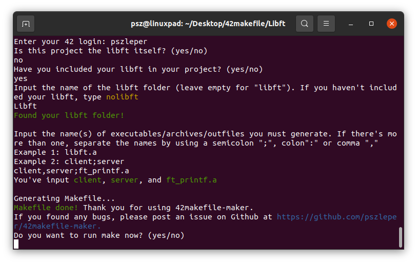

# 42makefile-maker
This python script lets you create makefiles for your 42 projects with a simple command interface.  
Supports libft integration, generating multiple executables, as well as determining automatically whether to use ar or gcc among other features.  
The generated makefile is compliant with the norm's expectations: it generates a header; all, clean, fclean and re rules; and so on.



## Usage
Go to your project's directory, then run:
```
git clone https://github.com/pszleper/42makefile-maker
python3 42makefile-maker/42makefile-maker.py
```

Afterwards just respond to the prompts and you're good to go!
You may only need to clean up the SRC_EXECUTABLENAME variables yourself if you've got multiple executables, see comment in the generated Makefile.

## Including your libft
Simply input the path to your libft folder, the script will then create a make rule that will call your libft's Makefile and transfer all .h files and the libft.a archive from your libft folder to your main project directory.

## Bugs/contributing
If you find a bug/exception or if the makefile-maker gives unexpected results, feel free to post an issue here with details regarding your input as well as the machine you ran it on.

If you modified the script and think the changes may be of use to someone else, send a pull request!
<br></br>
Licensed with MIT.